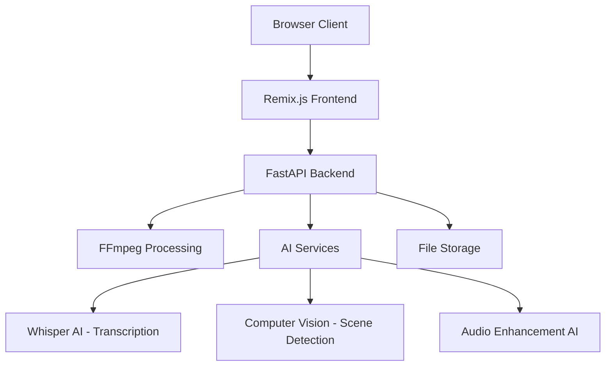

# Design Document

## Overview

The AI Video Editor is a web-based application that provides a professional, Apple-inspired interface for video editing with AI-powered features. The system follows a client-server architecture with a Remix.js frontend and Python FastAPI backend, designed to deliver a seamless, responsive user experience that prioritizes simplicity and functionality.

## Architecture

### High-Level Architecture



### Frontend Architecture (Remix.js)

- **Framework**: Remix.js with TypeScript for type safety and modern React patterns
- **Styling**: Tailwind CSS with custom design system for consistent Apple-inspired aesthetics
- **State Management**: React hooks and context for local state, server state managed by Remix loaders/actions
- **Real-time Updates**: WebSocket connections for live preview updates and processing status
- **File Handling**: HTML5 File API with drag-and-drop support

### Backend Architecture (Python FastAPI)

- **Framework**: FastAPI for high-performance API with automatic documentation
- **Video Processing**: FFmpeg integration for video/audio manipulation
- **AI Integration**: Modular AI services for transcription, scene detection, and enhancement
- **Storage**: Cloud storage integration (AWS S3/Google Cloud) for media files
- **Authentication**: JWT-based authentication with secure session management

## Components and Interfaces

### Frontend Component Hierarchy

```
App
├── Header
│   ├── Logo
│   ├── ProjectTitle
│   └── ActionButtons (Help, Export)
├── MainLayout
│   ├── LeftPanel
│   │   ├── MediaLibrary
│   │   │   ├── UploadZone
│   │   │   └── MediaGrid
│   │   │       └── MediaThumbnail[]
│   │   └── Inspector
│   │       ├── PropertySections
│   │       └── AIFeatureButtons
│   ├── CenterPanel
│   │   ├── PreviewPlayer
│   │   └── Timeline
│   │       ├── TimelineHeader
│   │       ├── Playhead
│   │       └── Track[]
│   │           └── TimelineClip[]
│   └── RightPanel (Future: Effects Library)
```

### Design System

#### Color Palette
```css
/* Primary Colors */
--bg-primary: #111827;     /* bg-gray-900 */
--bg-secondary: #1f2937;   /* bg-gray-800 */
--bg-tertiary: #374151;    /* bg-gray-700 */

/* Text Colors */
--text-primary: #f9fafb;   /* text-gray-50 */
--text-secondary: #d1d5db; /* text-gray-300 */
--text-muted: #9ca3af;     /* text-gray-400 */

/* Accent Colors */
--accent-gradient: linear-gradient(135deg, #60a5fa, #a855f7);
--success: #10b981;        /* green-500 */
--warning: #f59e0b;        /* amber-500 */
--error: #ef4444;          /* red-500 */

/* Interactive States */
--border-default: #4b5563; /* border-gray-600 */
--border-active: #60a5fa;  /* border-blue-400 */
--hover-bg: #4b5563;       /* bg-gray-600 */
```

#### Typography Scale
```css
/* Headings */
.text-h1 { @apply text-4xl font-bold text-gray-50; }
.text-h2 { @apply text-xl font-semibold text-gray-100; }

/* Body Text */
.text-body { @apply text-base font-normal text-gray-200; }
.text-ui { @apply text-sm font-medium text-gray-100; }
.text-meta { @apply text-xs font-light text-gray-400; }
```

#### Component Styling Patterns
```css
/* Panels */
.panel { @apply bg-gray-800 rounded-lg border border-gray-700; }

/* Interactive Elements */
.button-primary { @apply px-4 py-2 rounded-md bg-gradient-to-r from-blue-400 to-purple-500 text-white font-medium transition-transform hover:scale-105; }
.button-secondary { @apply px-4 py-2 rounded-md bg-gray-700 text-gray-100 font-medium hover:bg-gray-600 transition-colors; }

/* Form Controls */
.slider-track { @apply w-full h-2 bg-gray-700 rounded-full; }
.slider-thumb { @apply w-4 h-4 bg-gray-400 rounded-full cursor-pointer; }
.input-field { @apply bg-gray-700 border-none rounded-md px-3 py-2 text-gray-100; }
```

### Key Component Specifications

#### MediaLibrary Component
- **Upload Zone**: Drag-and-drop area with visual feedback states
- **File Validation**: Accept video (mp4, mov, avi), audio (mp3, wav, aac), image (jpg, png, gif)
- **Thumbnail Generation**: Server-side thumbnail creation for video files
- **Grid Layout**: Responsive 2-column grid with hover overlays

#### Timeline Component
- **Zoom Control**: Horizontal zoom from 1x to 100x with smooth scaling
- **Track Management**: Dynamic track creation (Video, Audio, Captions)
- **Clip Rendering**: Canvas-based rendering for performance with large projects
- **Magnetic Snapping**: 10-pixel snap tolerance for clip alignment
- **Playhead**: Draggable with real-time preview updates

#### Inspector Component
- **Context Awareness**: Dynamic property panels based on selection type
- **Real-time Updates**: Debounced property changes (300ms) to prevent excessive API calls
- **Validation**: Client-side validation with server-side confirmation
- **AI Integration**: Contextual AI feature buttons based on clip type

#### PreviewPlayer Component
- **Video Rendering**: HTML5 video element with custom controls
- **Frame Accuracy**: Seek to exact frame positions for precise editing
- **Quality Adaptation**: Dynamic quality adjustment based on viewport size
- **Overlay Support**: Text, graphics, and effect overlays rendered in real-time

## Data Models

### Frontend Data Models

```typescript
interface Project {
  id: string;
  name: string;
  duration: number;
  fps: number;
  resolution: { width: number; height: number };
  tracks: Track[];
  createdAt: Date;
  updatedAt: Date;
}

interface Track {
  id: string;
  type: 'video' | 'audio' | 'captions';
  name: string;
  clips: Clip[];
  locked: boolean;
  visible: boolean;
  volume?: number;
}

interface Clip {
  id: string;
  mediaId: string;
  startTime: number;
  endTime: number;
  trimStart: number;
  trimEnd: number;
  properties: ClipProperties;
}

interface ClipProperties {
  transform: {
    x: number;
    y: number;
    scale: number;
    rotation: number;
  };
  filters: {
    brightness: number;
    contrast: number;
    saturation: number;
  };
  audio: {
    volume: number;
    muted: boolean;
  };
}

interface MediaFile {
  id: string;
  filename: string;
  type: 'video' | 'audio' | 'image';
  duration?: number;
  thumbnailUrl: string;
  fileUrl: string;
  metadata: {
    width?: number;
    height?: number;
    fps?: number;
    codec?: string;
  };
}
```

### Backend Data Models

```python
from pydantic import BaseModel
from typing import Optional, List
from datetime import datetime

class MediaFileModel(BaseModel):
    id: str
    filename: str
    type: str
    duration: Optional[float]
    thumbnail_url: str
    file_url: str
    metadata: dict
    created_at: datetime

class TranscriptionSegment(BaseModel):
    text: str
    start: float
    end: float
    confidence: float

class TranscriptionResult(BaseModel):
    segments: List[TranscriptionSegment]
    language: str
    duration: float
```

## Error Handling

### Frontend Error Handling

1. **Network Errors**: Retry mechanism with exponential backoff
2. **File Upload Errors**: Clear error messages with suggested solutions
3. **Validation Errors**: Real-time validation with inline error display
4. **Processing Errors**: Progress indicators with error recovery options

### Backend Error Handling

1. **File Processing Errors**: Detailed error logging with user-friendly messages
2. **AI Service Failures**: Graceful degradation with fallback options
3. **Storage Errors**: Automatic retry with different storage endpoints
4. **Authentication Errors**: Clear error codes with appropriate redirects

## Testing Strategy

### Frontend Testing

1. **Unit Tests**: Jest + React Testing Library for component logic
2. **Integration Tests**: Cypress for user workflow testing
3. **Visual Regression**: Chromatic for UI consistency
4. **Performance Tests**: Lighthouse CI for performance monitoring

### Backend Testing

1. **Unit Tests**: pytest for individual function testing
2. **API Tests**: FastAPI TestClient for endpoint testing
3. **Integration Tests**: Docker-based testing with real services
4. **Load Tests**: Locust for performance under load

### Test Coverage Goals

- Frontend: 80% code coverage minimum
- Backend: 90% code coverage minimum
- Critical paths: 100% coverage (authentication, file processing, export)

## Performance Considerations

### Frontend Optimization

1. **Code Splitting**: Route-based and component-based lazy loading
2. **Asset Optimization**: Image compression and WebP format support
3. **Virtual Scrolling**: For large media libraries and timeline clips
4. **Debounced Updates**: Prevent excessive API calls during property changes

### Backend Optimization

1. **Async Processing**: Background tasks for video processing and AI operations
2. **Caching**: Redis for frequently accessed data and thumbnails
3. **CDN Integration**: CloudFront/CloudFlare for media file delivery
4. **Database Optimization**: Indexed queries and connection pooling

### Scalability Considerations

1. **Horizontal Scaling**: Stateless backend services with load balancing
2. **Microservices**: Separate services for AI processing and file handling
3. **Queue Management**: Celery/RQ for background job processing
4. **Storage Scaling**: Cloud storage with automatic scaling capabilities